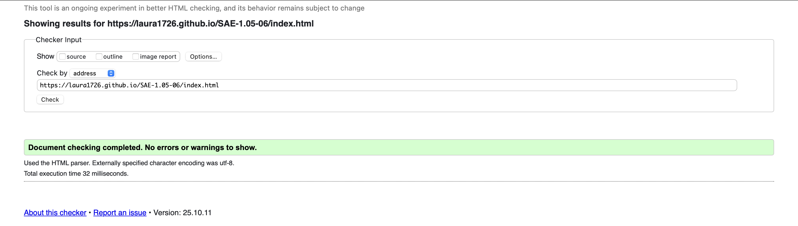
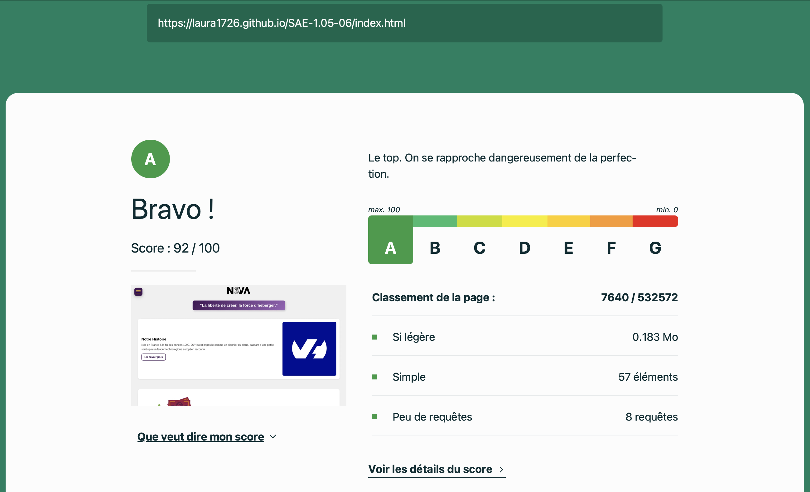
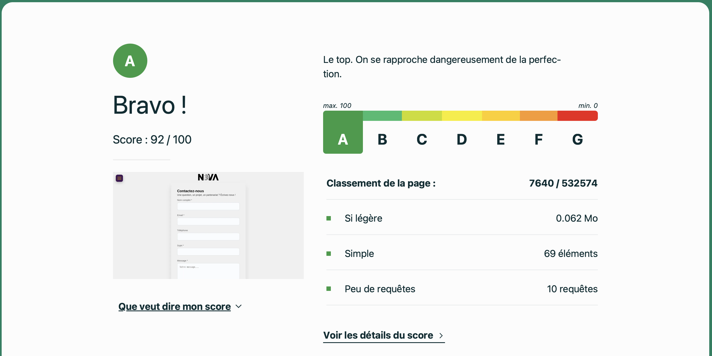
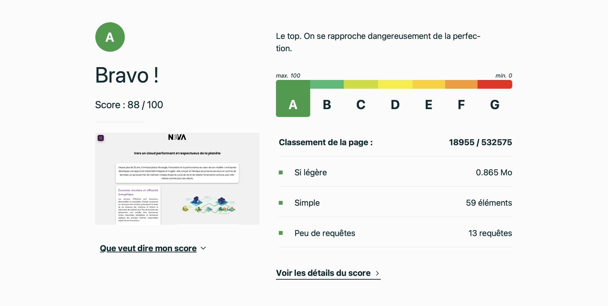
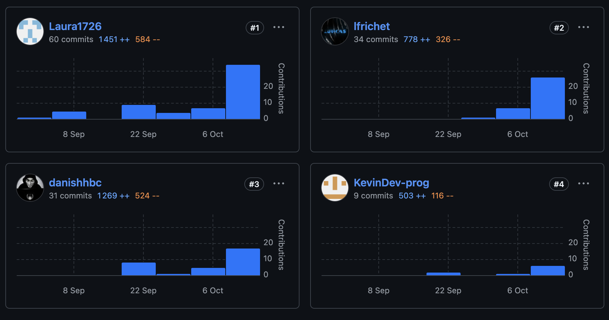

# Site d'informations sur OVHcloud  

## SAE S1 05-06

[Site web SAE_05-06](https://laura1726.github.io/SAE-1.05-06/)

## Membres du groupe :

Etudiant 1 (référente du groupe) :  [Laura BORNERT](mailto:laura.bornert@edu.univ-fcomte.fr?subject=SAE_1_05_06)  
Etudiant 2 : [Lucas FRICHET](mailto:lucas.frichet02@edu.univ-fcomte.fr?subject=SAE_1_05_06)   
Etudiant 3 : [Kevin PADAYODI](mailto:kevin.padayodi@edu.univ-fcomte.fr?subject=SAE_1_05_06)  
Etudiant 4 : [Danis HABIBOVIC](mailto:danis.habibovic@edu.univ-fcomte.fr?subject=SAE_1_05_06)   

# Présentation du projet

Ce dépôt correspond à un site web créé en HTML/CSS/JS dans le cadre de la SAÉ 05-06 à l'IUT de Belfort-Montbéliard. Ce site présente des informations concernant l'entreprise OVHcloud et sert de vitrine pour présenter l'entreprise, ses activités, son organisation et son historique. Vous trouverez dans ce dépôt et sur le site un rapport économique analysant l'aspect économique de OVHcloud.

## Choix de conception  

Pour la conception du site, nous nous sommes inspirés du site officiel de ***OVHcloud**** (disponible [ici](https://www.ovhcloud.com/fr/)), du site de  [Evian](https://www.evian.com/fr/), [SpaceX](https://www.spacex.com), [Formule1](https://gpcanada.ca). Nous n'avons pas repris exactement les mêmes design, mais nous nous en sommes inspiré.

## Développement Site Web et Validation des pages

### Page d'accueil et Contact

**Auteur : Danis HABIBOVIC** 

Page Accueil : 

Vérification W3C : [Détail ICI](https://validator.w3.org/nu/?doc=https%3A%2F%2Flaura1726.github.io%2FSAE-1.05-06%2Findex.html)

Page Contact : 

Vérification W3C : [Détail ICI](https://validator.w3.org/nu/?doc=https%3A%2F%2Flaura1726.github.io%2FSAE-1.05-06%2Findex.html)

### Page Histoire

**Auteur : Kevin PADAYODI**  

Vérification W3C : [Détail ICI]()

### Page Environnement && Innovations

**Auteur : Laura Bornert**  

Vérification W3C : [Détail ICI](https://validator.w3.org/nu/?doc=https%3A%2F%2Flaura1726.github.io%2FSAE-1.05-06%2Fenvironnement.html)

### Page Economie (Quelques Chiffres)

**Auteur : Lucas Frichet** 

Vérification W3C : [Détail ICI]()

## Développement Site Web et Validation des pages

### Page d'accueil

**Auteur : Nom Prénom**  

ou 

ou 

### Présentation générale

**Auteur : Nom Prénom**  

Verification W3C : [Détail ICI](https://validator.w3.org/nu/?showsource=yes&showoutline=yes&showimagereport=yes&doc=https%3A%2F%2Fdemo-am90.github.io%2Fs1-demo%2Findex.html)

 

 

## Répartition du travail

### Planification - Diagramme de GANTT

- Nom Prénom

### Recherches d'informations

- Nom Prénom
- Nom Prénom

### Développement site

- Nom Prénom
  - Page d’accueil
  - "Template" de page (Navbar/Footer)
  - Page présentation
- Nom Prénom
  - Page histoire
- Nom Prénom
  - Page organisation

## Contributeurs

